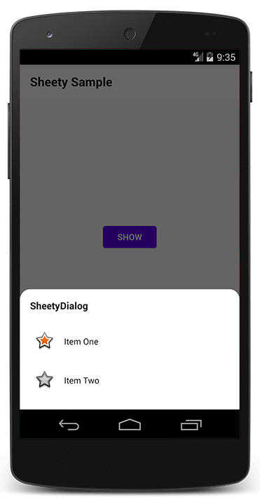

Sheety
=======

A simple customization of BottomSheetDialog selector to provide fast and intuitive use.

[](https://jitpack.io/#jdsdhp/sheety) 
[](https://github.com/jdsdhp/sheety/blob/master/LICENSE) 
[](https://twitter.com/jdsdhp)

## Screenshots



## Including in your project

#### Gradle

```gradle
allprojects  {
    repositories {
        ...
        maven { url 'https://jitpack.io' }
    }
}
dependencies {
    implementation 'com.github.jdsdhp:sheety:$version'
}
```

## Usage

### Kotlin
```kotlin
SheetyBuilder(context)
    .title("SheetyDialog")
    .item("Item One", android.R.drawable.star_big_on,
         SafeClickListener {   
              Toast.makeText(this, "Item One clicked!", Toast.LENGTH_SHORT).show()
         })
    .item("Item Two", android.R.drawable.star_big_off,
         SafeClickListener {
              Toast.makeText(this, "Item Two clicked!", Toast.LENGTH_SHORT).show()
         })
    .show()
```

### Styling
For use rounded corners just add the next line into style.xml file.

```xml
<style name="AppTheme" parent="Theme.MaterialComponents.Light.NoActionBar">
     <!-- Your app style here...... -->
         
     <!--Add this line-->
     <item name="bottomSheetDialogTheme">@style/SheetyDialogTheme</item> 
</style>
```

## Sample project

It's very important to check out the sample app. Most techniques that you would want to implement are already implemented in the examples.

View the sample app's source code [here](https://github.com/jdsdhp/sheety/tree/master/app)

License
=======

    Copyright (c) 2020 jesusd0897.
    
    Licensed under the Apache License, Version 2.0 (the "License");
    you may not use this file except in compliance with the License.
    You may obtain a copy of the License at
    
        http://www.apache.org/licenses/LICENSE-2.0
    
    Unless required by applicable law or agreed to in writing, software
    distributed under the License is distributed on an "AS IS" BASIS,
    WITHOUT WARRANTIES OR CONDITIONS OF ANY KIND, either express or implied.
    See the License for the specific language governing permissions and
    limitations under the License.
